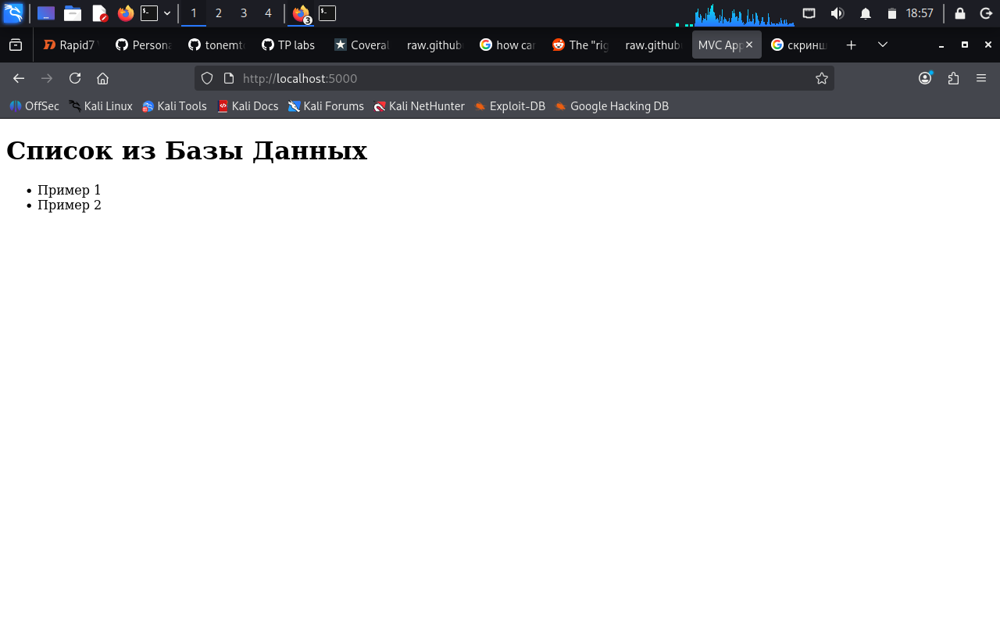

## Лабораторная работа по работе с docker
Работа посвящена изучению технологии работы с контейнерами
## Домашнее задание

В репозитории приведен код web-приложения, которое сохраняет в БД введенную информацию о задаче - ее имя.

## Часть I. Docker

1. Добавьте в код Dockerfile, который позволит запустить web-приложение с исходным кодом в каталоге app/ через docker.
2. Выполните запуск контейнера с этим приложением.
3. Скопируйте из консоли в каталог /home/ контейнера файл README.md.
4. Подключитесь к терминалу контейнера с приложением в интерактивном режиме. Проверьте, что скопированный файл находится в нужном каталоге.
5. Выйдите из интерактивного режима.
6. Остановите контейнер с приложением.

## Часть II. Docker compose
1. Создайте файл docker-compose.yml таким образом, чтобы совместно с описанным в части 1 контейнером работала бы база данных mysql. Файл инициализации БД в каталоге db/init.sql. Также пропишите порт подключения к приложению. Например 5000.
2. Запустите связку web-приложение - БД.
3. Проверьте подключение к приложению через браузер. Сделайте снимок экрана.
4. Проверьте работу приложения через браузер.

##Cкриншот работы приложения

